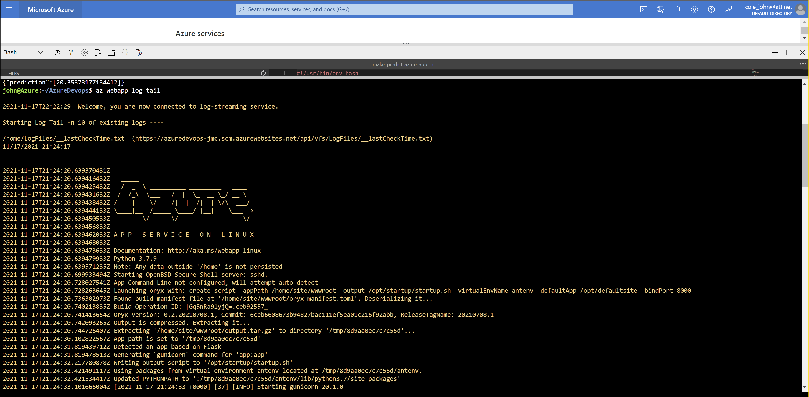

# Overview

This project implements a Python Flask application to serve out predictions for Boston housing prices through an sklearn machine learning model. This model has been trained to predict housing prices based on features such as average rooms in a home, highway access, and teacher-to-pupil ratios. Thiis project will also implement a Continous Delivery and Continuous Integration with Github and MS Azure.

## Project Plan

* [Trello](https://trello.com/b/8bmIWcdN )
* [Project Spreadsheet](./screenshots/project-management-AzureDevOps.xlsx)

### Architecture


## Instructions

### Generate SSH Keys and load into Github

1. Log into Azure Shell from Azure Portal


2. Create SSH Keys
```
 ssh-keygen -t rsa

```
3. Use CAT command to view SSH File that you just created. Highlight SSH Key and copy (CTL-C).
```
 cat /home/.ssh/id_rsa.pub

```
4. Go to Github and click on Settings under your image and choose SSH and GPG keys. Click Add New SSH Key


5. Enter Title and Paste (CTL-V) the copied SSH key


6. Clone Project into Azure
```
git clone https://github.com/jmcole/AzureDevops.git

```


### Create Project Scaffolding

1. Create a file named `Makefile` within the project folder. This file does not need an extension. Copy the following code into the new file. Makefiles requires tabbed spaces, so as a precaution replaces spaces with tabs and save.
```
install:
    pip install --upgrade pip &&\
        pip install -r requirements.txt

test:
    python -m pytest -vv test_hello.py


lint:
    pylint --disable=R,C hello.py

all: install lint test

```
2. Create a `requirements.txt` file. Add the required libraries.

```
pylint
pytest

```
3. Create Test and Script Files and paste in code.

`hello.py`
```
def toyou(x):
    return "hi %s" % x


def add(x):
    return x + 1


def subtract(x):
    return x - 1
```
`test_hello.py`
```
from hello import toyou, add, subtract


def setup_function(function):
    print("Running Setup: %s" % function.__name__)
    function.x = 10


def teardown_function(function):
    print("Running Teardown: %s" % function.__name__)
    del function.x


### Run to see failed test
#def test_hello_add():
#    assert add(test_hello_add.x) == 12

def test_hello_subtract():
    assert subtract(test_hello_subtract.x) == 9
```
### Perform Test in Azure Cloud
1. Push code from local devlopment to Github. Pull code from Github into Azure Cloud.
2. Create virtual environment in Azure Cloud Shell
```
python3 -m venv ~/.myrepo
source ~/.myrepo/bin/activate
```
3. Run `make all``. This will install, lint, and test the code. Code should pass all tests before proceeding.


### Configure Github Actions
1. Click on Actions in Github and Create a new Workflow
2. Choose setup a workflow yourself. Name the `yml` file `pythonapp.yml`
3. This will create a new folder in your repository. Pull code into local repository
4. Open `pythonapp.yml` and replace code with the following and push into Github repo.
```
name: Python application test with Github Actions

on: [push]

jobs:
  build:

    runs-on: ubuntu-latest

    steps:
    - uses: actions/checkout@v2
    - name: Set up Python 3.5
      uses: actions/setup-python@v1
      with:
        python-version: 3.5
    - name: Install dependencies
      run: |
        make install
    - name: Lint with pylint
      run: |
        make lint
    - name: Test with pytest
      run: |
        make test
```
5. Ensure Tests Pass


## Integrate Flask App into Repository
With the scaffolding complete the provided machine learning application can be added to the repository.
[Flask App Source Code](https://github.com/udacity/nd082-Azure-Cloud-DevOps-Starter-Code/tree/master/C2-AgileDevelopmentwithAzure/project/starter_files) 

### Testing Code Locally

The Flask App will require configuration to ensure that it operates succesfully. This can be done on the local machine or within the Azure CLI. To test in Azure cloud, follow the steps noted earlier in [Perform Test in Azure Cloud](https://github.com/jmcole/AzureDevops#perform-test-in-azure-cloud). After the `MakeFile` succesfully runs, start the flask app.
```  
export FLASK_APP=app.py
flask run
```


Open a new tab and loginto Azure CLI again to test application.
Run command
```
./make_prediction.sh

```


## Create Azure AppService
In Azure CLI, create the webapp
```
az webapp up --name azuredevops-jmc --resource-group resource-group-east --sku FREE
```
This will create the web app which will run our project.


After application completes you can check out the created web application in the Azure Portal. Take note of the URL that was created


## Setup Pipeline
Setting up a pipeline between GitHub and Azure will allows us to seamlessly push code from our local machine into the cloud.

1. Create an [AzureDevops](https://azure.microsoft.com/en-us/services/devops/) Account.
2. Follow [Microsoft tutorial](https://docs.microsoft.com/en-us/azure/devops/pipelines/ecosystems/python-webapp?view=azure-devops&WT.mc_id=udacity_learn-wwl) to set up pipeline

Azure Devops will link your Github repository to your Azure Web Application. Succesfull deployment of the pipeline will ensure that code pushed locally will flow to Github and then to Azure for deployment.

### Succesful deployment in Devops

### Succesful test of web application

### Succesful deployment of web page

### Web Tail Output on deployed App

### Web Log on deployed App


## Locust Testing
Locust allows a devloper to perform load testing on their application.
 1. Install [Locust](https://locust.io/)
 ```
 pip install locust

 ```
 2. Create `locustfile.py`
 3. Run locust from command line
 4. Open [Locust](http://localhost:8089/) from web browser
 5. Perform tests on deployed app

### Locust Statistics

### Locust Graph


## Enhancements

This project could be improved by adding a front-end to allow users to interact with the web application directly and choose their own values. Also, a database could be added to allow users to save preferances and predictions.

## Demo 

* [Demo Video](https://youtu.be/DiiBNYAvXnE)


